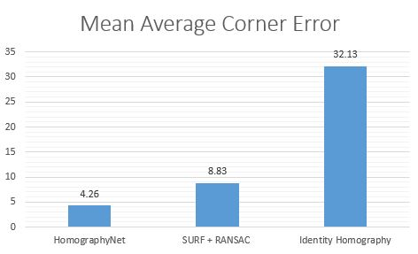
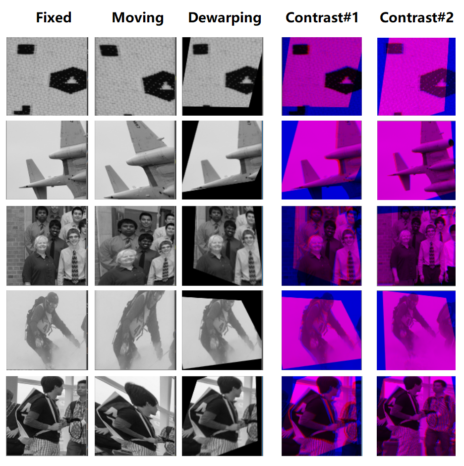

# HomographyNet

This is a deep convolutional neural network for estimating the relative homography between a pair of images. 
Deep Image Homography Estimation [paper](https://arxiv.org/abs/1606.03798) implementation in PyTorch.

## Features

- Backbone: MobileNetV2
- Dataset: MSCOCO 2014 training set

## DataSet

- Train/valid: generated 8,000/3,000 pairs of image patches sized 128x128(rho=32).
- Test: generated 5,000 pairs of image patches sized 256x256(rho=64).


## Dependencies

- Python 3.7.3
- PyTorch 1.3.1


## Usage
### Data Pre-processing
Extract training images:
```bash
$ python extract.py
$ python pre_process.py
```

### Train
```bash
$ python train.py --lr 0.005 --batch-size 64
```

If want to visualize during training, run in your terminal:
```bash
$ tensorboard --logdir runs
```

### Test
Unzip model file into .pt file. Homography Estimation Comparison on Warped MS-COCO 14 Test Set.
```bash
$ python export.py
$ python test.py
```
### Result
|Method|Mean Average Corner Error (pixels)|
|---|---|
|HomographyNet|3.53|
|SURF + RANSAC|8.83|
|Identity Homography|32.13|




